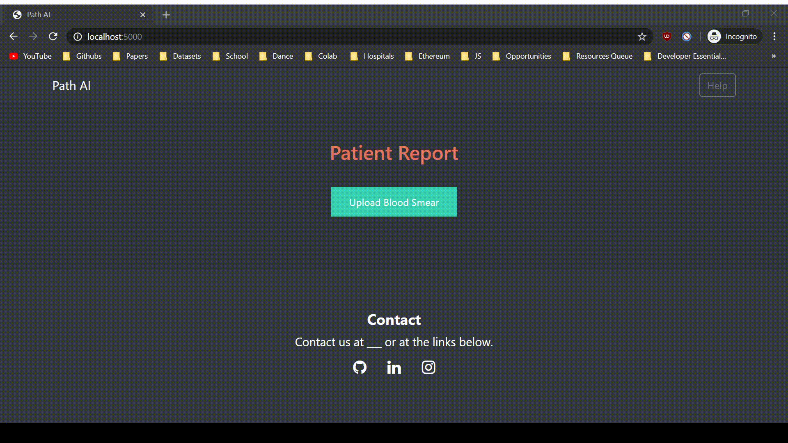

# Hacking Medicine 2019 (Team 110)

[]()
[](http://perso.crans.org/besson/LICENSE.html)

> Automatically classifying cancer in blood smear cells with Tensorflow and Keras.

* Credits to: https://github.com/mtobeiyf/keras-flask-deploy-webapp for the format for this app.
* __Team Members:__ Abhi Bhattaru, Joseph Chen, John Harman, Andrew Hudak, Basia Johnson
* Thanks to Raj and the other great mentors and pathologists at the 2019 MIT NYC Hacking Medicine event!

## Getting started in 10 minutes

- Clone this repo
- Install requirements
- Follow the workflow
- Check http://localhost:5000
- Done! :tada:

<p align="center">
  
</p>

# How to Use
## Convert to JPEG
Use `convert_to_jpeg.py` to convert your .tiff files to .jpeg. Make sure
that your files are arranged like the following:
```
blast_cells
  *.tiff
non_malignant
  *.tiff
```
The dataset is located [here](https://drive.google.com/open?id=1gxFw-Ddpi5DElvqUqM4QK5LOUVDSjSyN).

## Model Weights
* Approach uses MobilNetv2. The weights are located [here](https://drive.google.com/drive/u/0/folders/1T0cExvtBBMoJRbbbxKtQzl0pSzQaVzDZ)
* The `.h5` file should be placed in `models/`

## Run the script!
```
cd hacking_medicine_2019
python app.py
```
Then go to http://localhost:5000 and you should be good! Remember to restart the server if you change anything.

------------------
## Local Installation

### Clone the repo
```shell
$ git clone https://github.com/jchen42703/hacking_medicine_2019.git
```

### Install requirements

```shell
$ pip install -r requirements.txt
```

Make sure you have the following installed:
- tensorflow (< 2.0)
- keras
- flask
- pillow
- h5py
- gevent

### Run with Python

Python 2.7 or 3.5+ are supported and tested.

```shell
$ python app.py
```
------------------

## Customization

### Use your own model

Place your trained `.h5` file saved by `model.save()` under models directory.

Check the [commented code](https://github.com/mtobeiyf/keras-flask-deploy-webapp/blob/master/app.py#L25) in app.py.


### Use other pre-trained model

See [Keras applications](https://keras.io/applications/) for more available models such as DenseNet, MobilNet, NASNet, etc.

Check [this section](https://github.com/mtobeiyf/keras-flask-deploy-webapp/blob/master/app.py#L25) in app.py.

### UI Modification

Modify files in `templates` and `static` directory.

`index.html` for the UI and `main.js` for all the behaviors

## Deployment

To deploy it for public use, you need to have a public **linux server**.

### Run the app

Run the script and hide it in background with `tmux` or `screen`.
```
$ python app.py
```

You can also use gunicorn instead of gevent
```
$ gunicorn -b 127.0.0.1:5000 app:app
```

More deployment options, check [here](http://flask.pocoo.org/docs/0.12/deploying/wsgi-standalone/)

### Set up Nginx

To redirect the traffic to your local app.
Configure your Nginx `.conf` file.
```
server {
    listen  80;

    client_max_body_size 20M;

    location / {
        proxy_pass http://127.0.0.1:5000;
    }
}
```
